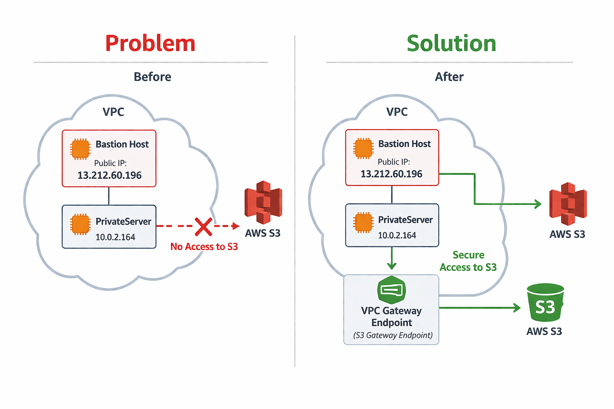
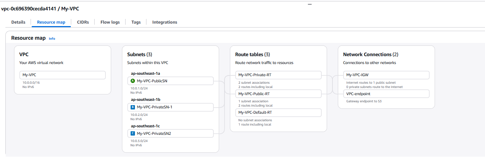
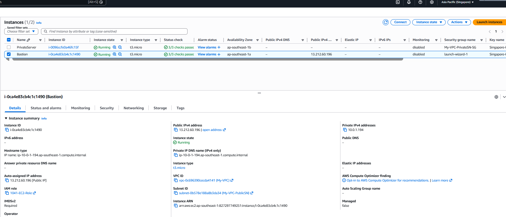
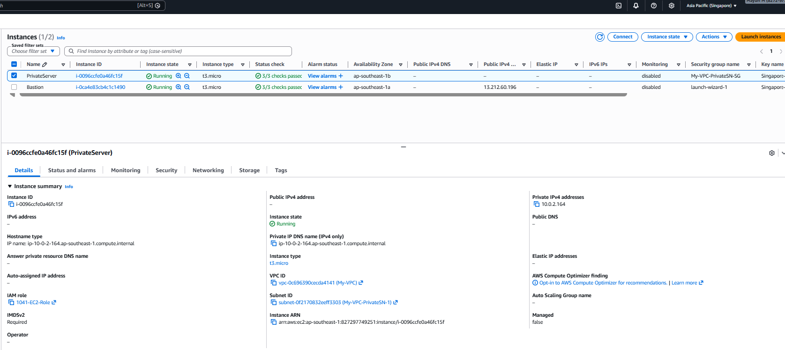
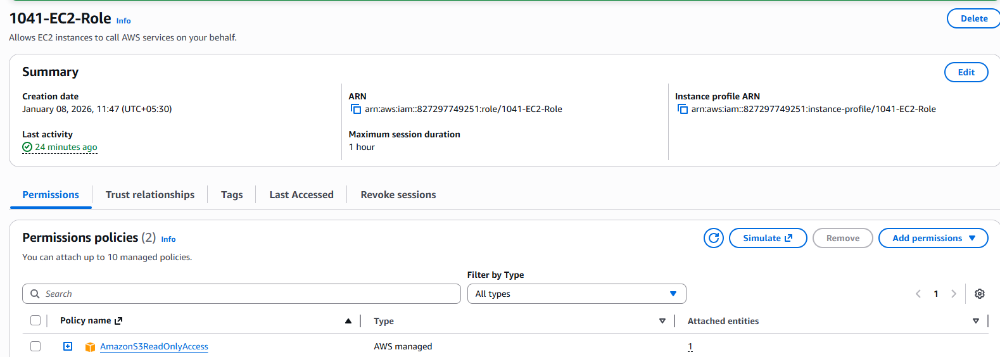
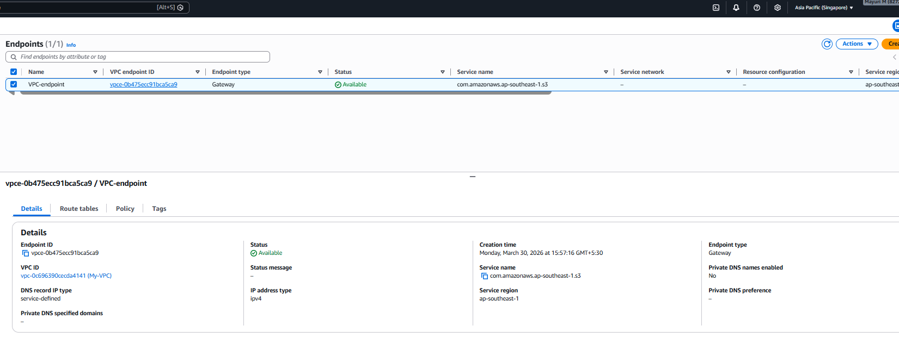
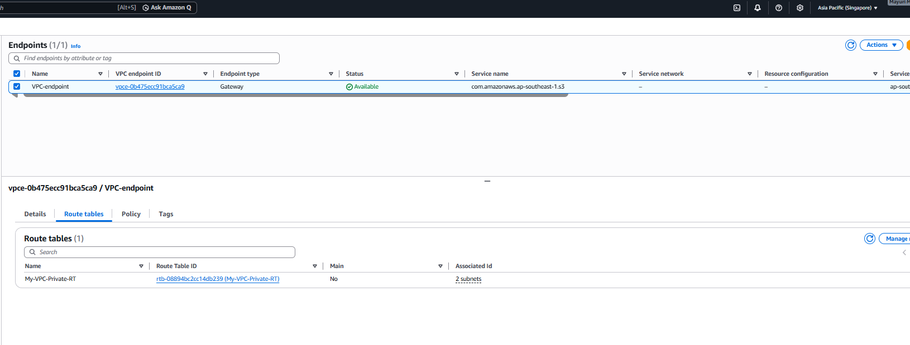
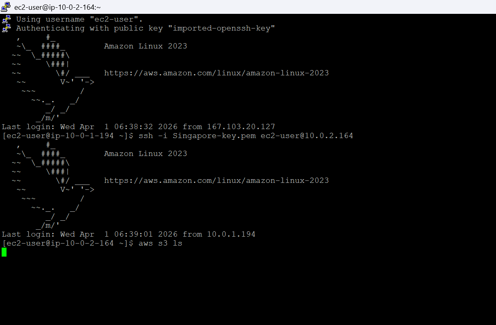
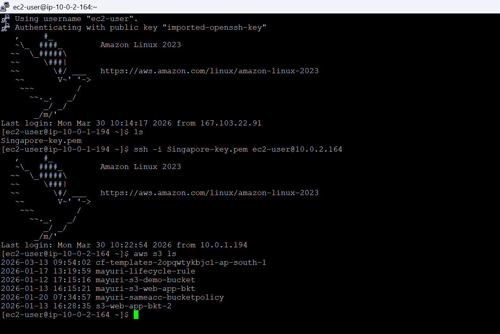

# Secure S3 Access from Private EC2 using VPC Endpoint

---

## Overview
This project demonstrates how a private EC2 instance (without internet access) can securely access Amazon S3 using a VPC Endpoint.

It highlights the importance of both **IAM permissions** and **network connectivity** in AWS.

---

## Architecture

- VPC with:
  - Public Subnet → Bastion Host
  - Private Subnet → Private Server
- Internet Gateway attached to public subnet
- Private subnet has **no internet access**
- IAM Role attached to EC2 instances
- VPC Gateway Endpoint for S3

---

## AWS Services Used

- Amazon EC2  
- Amazon S3  
- VPC (Subnets, Route Tables, Internet Gateway)  
- IAM Role  
- VPC Endpoint (Gateway Endpoint for S3)  

---

## Implementation Steps

### 1. Created VPC and Subnets
- Public subnet (for Bastion Host)
- Private subnet (for Private server)

---

### 2. Launched EC2 Instances
- Bastion Host (with public IP)
- Private EC2 (no public IP)

---

### 3. Configured IAM Role
- Attached IAM role with S3 access to both instances

---

### 4. Verified Access from Bastion Host

After configuring the VPC Gateway Endpoint and associating it with the private subnet’s route table, the PrivateServer was able to successfully access Amazon S3 without requiring internet connectivity. Running the aws s3 ls command from the PrivateServer now returns the list of S3 buckets, confirming that the issue has been resolved and that secure, private communication with S3 is established through the VPC endpoint.

