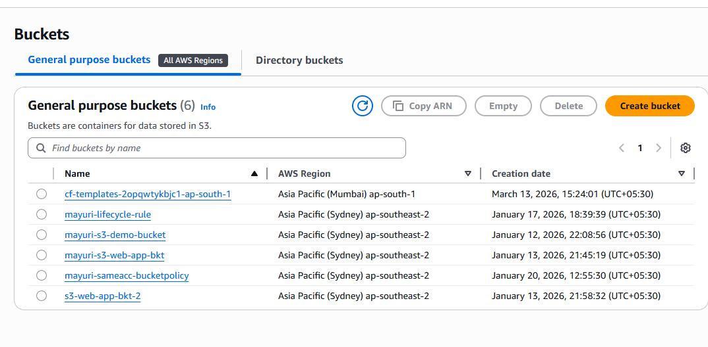

AWS Private EC2 to S3 using VPC Endpoint
📌 Problem Statement
Accessing Amazon S3 from an EC2 instance typically requires internet connectivity through an Internet Gateway or NAT Gateway. This increases cost and exposes traffic to the public internet.
This project demonstrates how to securely access S3 from a private EC2 instance using a VPC Gateway Endpoint, without requiring any internet access.
________________________________________
🏗️ Architecture Overview
This architecture is designed to ensure secure and private communication between EC2 and S3.
•	The EC2 instance is launched in a private subnet with no public IP.
•	A VPC Gateway Endpoint for S3 is configured.
•	An IAM Role is attached to the EC2 instance with S3 read permissions.
•	All communication between EC2 and S3 happens through the AWS internal network.
________________________________________
📊 Architecture Diagram

________________________________________
⚙️ Components Used
•	Amazon VPC
•	Private Subnet
•	Route Tables
•	EC2 Instance (Amazon Linux)
•	IAM Role (with S3 ReadOnly access)
•	Amazon S3 Bucket
•	VPC Gateway Endpoint for S3
________________________________________
🔧 Step-by-Step Implementation
1.	Created a custom VPC

2.	Created a private subnet inside the VPC
3.	Configured route table for private subnet (no internet route)
4.	Launched EC2 instance in private subnet (no public IP)

5.	Created an IAM role with S3 ReadOnly permissions
6.	Attached IAM role to EC2 instance

7.	Created an S3 bucket and uploaded sample files

8.	Created a VPC Gateway Endpoint for S3

9.	Associated the endpoint with the route table

10.	Connected to EC2 and accessed S3 using PuTTY over SSH

________________________________________
🔐 Security Considerations
•	EC2 instance does not have a public IP
•	No Internet Gateway or NAT Gateway used for private subnet
•	IAM Role is used instead of storing access keys
•	Traffic between EC2 and S3 does not go through the public internet
________________________________________
💰 Cost Optimization
•	No NAT Gateway used, which reduces cost significantly
•	Data transfer stays within AWS network, minimizing charges
________________________________________
🧪 Verification Steps
•	Connected to EC2 instance using using PuTTY over SSH
•	Ran AWS s3 command to list S3 bucket contents
•	Verified that S3 access works without internet connectivity
________________________________________
💡 Key Learnings
•	Learned how to securely access AWS services without internet
•	Understood the importance of IAM roles over access keys
•	Explored VPC Gateway Endpoints for private connectivity
•	Gained knowledge about cost-efficient AWS architecture
________________________________________
🚀 Conclusion
This project demonstrates a secure and cost-effective way to access S3 from a private EC2 instance using a VPC Gateway Endpoint. It eliminates the need for internet access while maintaining high security standards.
